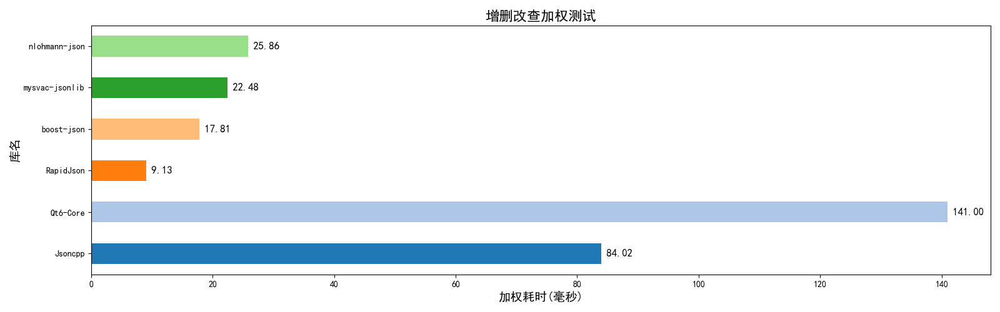

<div align="center">

# mysvac-jsonlib

<p>
   <a href="#ENGLISH"></a>
   &nbsp;&nbsp;
   <a href="#中文"></a>
</p>
<p>
    <a href="#simple-cmp">
        
    </a>
    &nbsp;&nbsp;
    <a href="https://github.com/Mysvac/cpp-json-test">
        
    </a>
</p>
</div>

---

<div id="ENGLISH">

# Modern C++JSON parsing library

## Overview
- C++17 standard
- Only standard library, cross platform
- Less than 1000 lines of code, lightweight
- Good performance
- Easy to use
- Serialization, deserialization, prettify, modification, and search
- Move and exception support
- Support installation from vcpkg


## Document
*I'm sorry, generate through document annotations, only zh_cn.*

↓↓↓↓↓↓↓↓↓↓↓↓↓↓↓↓<br>
[C++Doxygen文档](https://mysvac.github.io/cpp-jsonlib/documents/html/index.html)<br>
↑↑↑↑↑↑↑↑↑↑↑↑↑↑↑↑

## Application examples

### 0. Import libraries and header files
You can directly download the two code files from `src` and `include` and use them in your project.


You can also install from vcpkg, with a default static library (very small).
```shell
# Please update the vcpkg port using 'git pull' at first
# In classic mode
vcpkg install mysvac-jsonlib

# In manifest mode
vcpkg add port mysvac-jsonlib
```

```cmake
# CmakeLists.txt
find_package(mysvac-jsonlib CONFIG REQUIRED)
target_link_libraries(main PRIVATE mysvac::jsonlib)
```

```c++
// C++ source file -  include header file
#include "mysvac/jsonlib.h"
// using namespace, optional
using namespace Jsonlib;
```
### 1. Basic Types
Three operable types and six JSON data types
```c++
// The broad "value type" includes all six JSON data types such as object arrays.
class JsonValue;

// object type, essentially std::map<std::string, Jsonlib::JsonValue>
class JsonObject;

// array type, essentially std::vector<Jsonlib::JsonValue>
class JsonArray;

// use JsonValue.type() function, get inner date type
enum class JsonType{
    OBJECT, /**< JSON object */
    ARRAY,/**< JSON array */
    STRING, /**< JSON string */
    NUMBER, /**< JSON numver */
    BOOL, /**< JSON bool */
    ISNULL, /**< JSON null */
};
```

### 2. initializer_list

#### warning
Special care must be taken when using the `{ }` operator for initialization.<br>
As it behaves differently from `( )` initialization.

#### example：
```c++
JsonValue json1 = {
    { "key", nullptr },
    { 1, 2, 3, 4, 5 },
    "string",
    true,
    false,
    1234.5
};
```

#### Initialization Rules

1. **Empty Initializer** <br>
   Generates an JsonType::ISNULL object.
2. **Two-Element initializer and the first element is string**<br>
   Generates an JsonType::OBJECT object.
3. **All Other Cases**:
   Generates an JsonType::ARRAY object.

#### Important Considerations

- Even with a single element, `{ }` will still produce an ARRAY type.
- The `( )` initializer generating different types based on parameter types.
- Rule 2 may sometimes produce OBJECT types when ARRAY types were intended.


#### Recommended Practice
For ambiguous cases, we recommend explicit construction using dedicated type wrappers:
```c++
// JsonObject is essentially std::map<std::string, JsonValue>
// Requires double braces for list initialization
JsonValue json1 = JsonArray{
    JsonObject { {"key", nullptr} },
    JsonArray { 1, 2, "3", { 4 , 5 } },
    "string",
    true,
    false,
    1234.5
};
```


### 3. Deserialize and serialze
Use the `deserialize()` function for deserialization.<br>
Use the member function `object.serialize()` for serialization. <br>
Use the member function `object.serialize_pretty()` function for pretty-printed serialization.

```c++
JsonValue json = deserialize(R"(
    {
        "语法": ["C++", "raw string", false ],
        "key": "support\t中文\\\nand\"escape",
        "na\"\\me": [ 114,514 , null ],
        "map": [ {} , [ [ "嵌套" ] , {} ] ]
    }
    )");

// use '.serialize()' funciton to serialize and remove spaces
std::cout << json.serialize() << std::endl;
// use '.serialize_pretty()' function to serialize with line breaks and indentation
std::cout << json.serialize_pretty() << std::endl;
// You can specify the number of spaces to indent each time, which defaults to 2
std::cout << json.serialize_pretty(4) << std::endl;
```

### 4. CRUD Operations

#### Performance Considerations:

- JsonArray (essentially std::vector):
  - Insertion/deletion in the middle: O(n)
  - Modification: O(1) (direct access)
  - **Best Practice:** Prefer push_back() and pop_back() for efficient O(1) end operations.
- Object Type (essentially std::map):
  - All operations (insert/delete/modify): O(log n)

```c++
// Using the `json` variable from [3. Deserialization...]  
json.erase("na\"\\me");        // Delete a key  
json["map"][1].clear();        // Clear a nested structure  
json["Syntax"] = 114514;       // Modify a value  
json["add"] = deserialize("[[[]]]");  // Add a new key with nested arrays  
json["add"].push_back(1);     // Append to an array  

// Output results  
std::cout << json.serialize() << std::endl;  
std::cout << json["key"].as_string() << std::endl;  // Retrieve and unescape string  
```
possible output:
```
{"add":[[[]],1],"key":"支持\t中文\\\n与\"转义字符","map":[{},[]],"语法":114514}
support	中文\
and"escape
```

### 5. Use 'is' and 'as' function
example:
```c++
JsonValue value = 123456789012345ll;
// 'is_' function is noexcept
value.is_array(); // false
value.is_object(); // false
value.is_double(); // false 内部没有小数点
value.is_number(); // true int64和double都算number
// 'as_' function will throw exception if the convertion fail
value.as_int64(); // 123456789012345ll
value.as_double(); // 1.23457e+14 Could convert, but possible loss of accuracy
value.as_array(); // throw Jsonlib::JsonTypeException
```

### 6. Iterator and Move Semantics Support
#### Important Note:
The `JsonValue` **type does not support iterators directly** due to its internal type uncertainty.

However, you can obtain references to internal elements via `as_array()` and `as_object()` and then use iterators:

- `JsonArray` is essentially a `std::vector<JsonValue>`.
- `JsonObject` is essentially a `std::map<std::string, JsonValue>`.

#### Move Semantics:

- Fully supported.
- `JsonArray` and `JsonObject` objects can be assigned/moved to `JsonValue` without exceptions.


```c++
JsonValue my_obj = { "key1", { nullptr, 666 } };

JsonValue my_arr = JsonArray{ true, JsonObject{} };

// String construction (does not parse internally, no errors)  
// Note: Use () instead of {}  
JsonValue my_val("[ {} this is a string ]");  

// as_array() and as_object() return references; others return copies  
for (auto& it : my_arr.as_array()) {  
    // 'it' is of type Jsonlib::JsonValue&  
    // Perform operations...  
}  

// Supports move semantics; moved-from object becomes JsonType::ISNULL (not deleted)  
my_arr.insert(1, std::move(my_obj["key"]));  
my_arr.push_back(my_val);  

std::cout << my_arr.serialize_pretty() << std::endl;  
```
possible output:
```json
[
  null,
  [
    null,
    666
  ],
  { },
  "[ {} this is string ]"
]
```

#### WARNING:
Consider two `JsonValue` objects, **A** and **B**, where **A** contains **OBJECT** or **ARRAY** data.<br>
When using move semantics on internal sub-elements:

- **The sub-element must be of type `JsonValue`, not `JsonObject` or `JsonArray`**.

##### Undefined Behavior Example:

```cpp
B = std::move(A.as_object());  // ❌ Dangerous!
```
This directly moves A's internal data block without updating A's type control data, leading to undefined behavior.<br>
(Reason: This invokes the move operation for JsonObject, bypassing JsonValue's type management.)

##### Safe Operations:

```cpp
B = std::move(A);          // ✅ Properly resets A to null.  
B = std::move(A["xxx"]);   // ✅ Sub-element access returns JsonValue, ensuring type safety.  
```

##### Key Takeaways:

1. Direct moves of as_object()/as_array() are unsafe—they bypass JsonValue's type system.
2. Moving the entire JsonValue or its sub-elements (via operator[]) is safe and correctly handles type transitions.
3. Moved-from objects become JsonType::ISNULL but remain valid (no deletion).

💡 Best Practice: Prefer moving JsonValue objects (not JsonObject/JsonArray views) to ensure type consistency. Use operator[] for nested element moves.

### 7. Exception handle

1. `JsonException` : inherits from `std::runtime_runtime_error`, is not thrown anywhere.
2. `JsonTypeException` : inherits from`JsonException`, type error (e.g. type conversion failed).
3. `JsonStructureException` : inherits from `JsonException`, structure error and deserialization fail
4. `std::out_of_range` : Accessing child element with `at()` but the element is out of bounds or doesn't exist

Example：
```cpp
try{
    JsonValue json = deserialize("[ {}} ]");
}
catch(const JsonStructureException& e){
    std::cerr << "JsonStructureException: " << e.what() << std::endl;
}
catch(const JsonException& e){
    std::cerr << "JsonException: " << e.what() << std::endl;
}
catch(...){ std::cerr << "other" << std::endl; }
```
possiable output:
```
JsonStructureException: Unknown Json Structure.
```

#### notes
No exceptions will be thrown by assignment/copy/move/serialization/`is_xx()`/`type()`/`size()`... operations.

Exceptions may only be thrown by `deserialize()` or failed type conversion via `as_xxx()`, or out-of-bounds access.

## Performance overview
*Time complexity is mostly theoretical - real-world gains come from constant optimizations.*
- **N** : JSON text length
- **M** : Number of child elements

Worst-case complexity:
- **Serialization** : Time O(N), Space O(N)
- **Deserialization** : Time O(N), Space O(N)
- **Key-value operations** (CRUD) : O(log m)
- **Array operations:**
    - Append/delete at end: O(1)
    - Insert/delete else where: O(m) average
    - Update/access: O(1)

</div>

---

<div id="中文">

# 现代C++ JSON解析库 

## 概述

- C++17 标准
- 仅标准库，跨平台
- 代码不到1000行，轻量
- 性能较好
- 操作非常简单
- 序列化、反序列化、美化、增删改查
- 移动语义与异常处理支持
- 支持从vcpkg安装库


## 文档
↓↓↓↓↓↓↓↓↓↓↓↓↓↓↓↓<br>
[C++Doxygen文档](https://mysvac.github.io/cpp-jsonlib/documents/html/index.html)<br>
↑↑↑↑↑↑↑↑↑↑↑↑↑↑↑↑

## 应用示例

### 0. 导入库与头文件
你可以直接下载`src`和`include`中的两个代码文件，放到项目中使用。

也可以作为第三方库导入（默认静态库），方式如下：

```shell
# 请先使用'git pull'更新vcpkg端口文件
# 全局模式
vcpkg install mysvac-jsonlib

# 清单模式
vcpkg add port mysvac-jsonlib
```

```cmake
# CmakeLists.txt
find_package(mysvac-jsonlib CONFIG REQUIRED)
target_link_libraries(main PRIVATE mysvac::jsonlib)
```

```c++
// C++代码 导入头文件
#include "mysvac/jsonlib.h"
// 导入命名空间简化代码，可选
using namespace Jsonlib;
```

### 1. 基本类型介绍
三种可操作类型和六种JSON数据类型：
```c++
// 广义的“值类型”，包含 对象 数组 等全部6种JSON数据类型。
class JsonValue;

// 对象类型，本质是 std::map<std::string, JsonValue>
class JsonObject;

// 数组类型，本质是 std::vector<JsonValue>
class JsonArray;

// 使用 JsonValue.type() 函数，获取内部JSON数据类型
enum class JsonType{
    OBJECT, /**< JSON 对象类型 */
    ARRAY,/**< JSON 数组类型 */
    STRING, /**< JSON 字符串类型 */
    NUMBER, /**< JSON 数值类型 */
    BOOL, /**< JSON 布尔类型 */
    ISNULL, /**< JSON null类型 */
};
```

### 2. 列表初始化
需要注意，既然存在列表初始化函数，就要谨慎使用`{ }`运算符进行初始化。<br>
因为`{ }`和`( )`初始化器会带来不同的行为。

参考代码：
```c++
JsonValue json1 = {
    { "key", nullptr },
    { 1, 2, 3, 4, 5 },
    "string",
    true,
    false,
    1234.5
};
```

生成规则：
1. 如果初始化器为空，则生成ISNULL类型对象。
2. 如果初始化器只有2个元素，且第1个元素是字符串，则生成OBJECT。
3. 其他情况则生成ARRAY类型对象。

注意规则3，`{}`运算符构造，内部只有1个元素，依然只会生成ARRAY类型对象。<br>
而`()`运算符构造，等同赋值语句，根据参数类型生成不同类型的对象。

注意规则2，有的时候需要ARRAY对象，却会被此规则生成OBJECT对象。<br>
所以我更推荐你在类型模糊时，使用如下方式创建：
```c++
// JsonObject本质是std::map<std::string, JsonValue>，必须套双重括号进行列表初始化
JsonValue json1 = JsonArray{
    JsonObject { {"key", nullptr} },
    JsonArray{ 1, 2, 3, 4, 5 },
    "string",
    true,
    false,
    1234.5
};
```


### 3. 反序列化与序列化
使用`deserialize()`函数进行反序列化。<br>
使用`对象.serialize()`成员函数进行序列化。<br>
使用`对象.serialize_pretty()`函数函数进行美化序列化，可指定缩进长度。

参考代码：
```c++
JsonValue json = deserialize(R"(
    {
        "语法": ["C++", "原始字符串", false ],
        "key": "支持\t中文\\\n与\"转义字符",
        "na\"\\me": [ 114,514 , null ],
        "map": [ {} , [ [ "嵌套" ] , {} ] ]
    }
    )");

// serialize序列化 不保留无效空格
std::cout << json.serialize() << std::endl;
// serialize_pretty序列化 带空格和换行，默认一次缩进2空格，可指定
std::cout << json.serialize_pretty() << std::endl;
```

### 4. 增删改查
需要注意的是，数组类型本质是`std::vector`，所以中间插入和删除元素是O(m)的，修改是正常O(1)。<br>
无特殊情况，尽量使用`push_back()`和`pop_back()`在末尾修改。

而对象类型的本质是`std::map`，操作都是O(log m)级别。

参考代码：
```c++
// json变量是上面【3. 反序列...】中的json变量
json.erase("na\"\\me"); // 删除
json["map"][1].clear(); // 清空
json["语法"] = 114514; // 修改
json["add"] = deserialize("[[[]]]"); //增加
json["add"].push_back(1); 

std::cout << json.serialize() << std::endl;
std::cout << json["key"].as_string() << std::endl; // 获取字符串并转义
```
可能的输出：
```
{"add":[[[]],1],"key":"支持\t中文\\\n与\"转义字符","map":[{},[]],"语法":114514}
支持	中文\
与"转义字符
```

### 5.使用is检测类型，使用as获取内容
参考代码：
```c++
JsonValue value = 123456789012345ll;
// is保证不会抛出异常
value.is_array(); // false
value.is_object(); // false
value.is_double(); // false 内部没有小数点
value.is_number(); // true int64和double都算number
// as 转换失败时抛出异常
value.as_int64(); // 123456789012345ll
value.as_double(); // 1.23457e+14 能够转化，但可能丢失精度
value.as_array(); // 抛出异常 Jsonlib::JsonTypeException
```


### 6. 迭代器与移动语义支持
需要注意的是，**JsonValue类型不支持迭代器**，因为内部类型不确定。

但是可以通过`as_array()`和`as_object()`获取内部元素的引用，然后使用迭代器。<br>
因为JsonArray本质是`std::vector<JsonArray>`，而JsonObject是`std::map<std::string, JsonValue>`。

移动语义当然是完全支持的，且JsonArray和JsonObject对象可以赋值/移动给JsonValue，必然成功，不会抛出异常。

参考代码：
```c++
JsonValue my_obj = { "key1", { nullptr, 666 } };

JsonValue my_arr = JsonArray { true, JsonObject{} };

// 字符串构造，不会解析内部数据，不会报错，注意使用()而不是{}
JsonValue my_val ("[ {} this is string ]");

// as_array()和as_object()返回引用，其他的as返回副本
for(auto& it: my_arr.as_array()){ 
    // it 的类型是 Jsonlib::JsonValue&
    // 具体操作...
}

// 支持移动，被移动的对象变成JsonType::ISNULL类型，不会删除
my_arr.insert(1, std::move(my_obj["key"]));
my_arr.push_back(my_val);

std::cout << my_arr.serialize_pretty() << std::endl;
```
可能的输出：
```json
[
  true,
  [
    null,
    666
  ],
  { },
  "[ {} this is string ]"
]
```

**警告**: 

假设现在有两个`JsonValue`类型的对象，A和B，A存储的是OBJECT或者ARRAY类型的数据。<br>
在使用移动语义时，如果移动内部子数据，必须保证子数据类型是`JsonValue`，而不是`JsonObject`或者`JsonArray`。

**比如下面的代码，将产生未定义行为：**
```c++
B = std::move(A.as_object()); // ❌ 危险!
```
这直接把A的内部数据块移动了出去，却没有修改A的类型控制数据，行为未定义。<br>
（因为这会调用针对`JsonObject`的移动方法，无法处理A作为`JsonValue`类型的特有信息。）

**而下面的操作都是可行的：**
```c++
B = std::move(A); // ✅
B = std::move(A["xxx"]); // ✅
```
直接移动A时，会正常重置类型信息，重置为null。<br>
正常的子元素访问，返回的是`JsonValue`类型，移动子元素，也能正常重置类型信息。


### 7. 异常处理
本库使用了三种自定义异常和一种标准：
1. `JsonException` : 继承自`std::runtime_runtime_error`，没有地方抛出此异常。
2. `JsonTypeException` : 继承自`JsonException`，表示类型错误，比如`as_xxx()`函数。
3. `JsonStructureException` : 继承自`JsonException`，表示JSON结构错误，导致反序列化失败。
4. `std::out_of_range` : 使用`at()`严格访问子元素，元素不存在或越界时抛出，

参考代码：
```c++
try{
    JsonValue json = deserialize("[ {}} ]");
}
catch(const JsonStructureException& e){
    std::cerr << "JsonStructureException: " << e.what() << std::endl;
}
catch(const JsonException& e){
    std::cerr << "JsonException: " << e.what() << std::endl;
}
catch(...){ std::cerr << "other" << std::endl; }
```
可能的输出：
```
JsonStructureException: Unknown Json Structure.
```

#### 注意
赋值/拷贝/移动/序列化/`is`/`type`/`size`...等操作保证不会抛出异常。

只有`deserialze()`反序列化函数，或者`as`类型转换失败，访问越界时可能抛出异常。


## 性能概述
*时间复杂度其实没什么用，看看就好，后面都是常数优化。*
- **N** : JSON文本长度。
- **m** : 子元素个数。
- 下面提供最坏情况的时空复杂度（虽然没什么用，后面都是常数优化。）：
- **序列化**：时间复杂度O(N)，空间复杂度O(N)。
- **反序列化**: 时间复杂度O(N)，空间复杂度O(N)。
- **键值对-增删改查**: O(log m)。
- **数组-增删**: 末尾操作O(1)，其余位置平均O(m)。
- **数组-改查**: O(1)。

</div>

---

<div id="simple-cmp">

# Simple Comparison | 简要对比
Lastest comprehensive test | 最新全面比较: <https://github.com/Mysvac/cpp-json-test>

test framework-1 | 测试框架-1 : <https://github.com/miloyip/nativejson-benchmark><br>
test framework-2 | 测试框架-2 : <https://github.com/Mysvac/cpp-json-test>

Note: The following tests were conducted earlier, `cpp-jsonlib` refers to this library.<br>
注：下面的测试进行时间较早，`cpp-jsonlib`代指本库。

## 1. Conformance testing | 一致性测试
Test the correctness, syntax rigor, floating-point precision, and other aspects of parsing JSON data using C++libraries. <br>
测试C++库解析json数据的正确性，语法严格性，浮点型精度等内容。

### Overall score | 整体分数


### Deserialize strictness test | 反序列化严格性测试


### Floating point precision test | 浮点数精度测试


### String escape test | 字符串转义测试


### roundtrip | 不知道是什么


## 2. Performance testing | 性能测试

### Time for deserialize | 反序列化耗时
Unit milliseconds, the lower the better<br>
单位毫秒，越低越好


### Memory used | 内存占用
Unit KB, the lower the better<br>
单位 KB ，越低越好


### Time for serialize | 序列化耗时
Unit milliseconds, the lower the better<br>
单位毫秒，越低越好


### Time for Modification and Query | 增删改查加权耗时
Unit milliseconds, the lower the better<br>
单位毫秒，越低越好

The QT deletion speed is very slow, resulting in an overall slow performance.<br>
QT删除子元素速度非常忙，导致整体偏慢。


</div>
