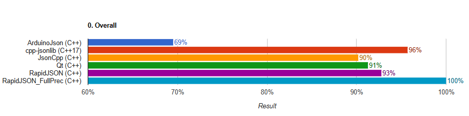
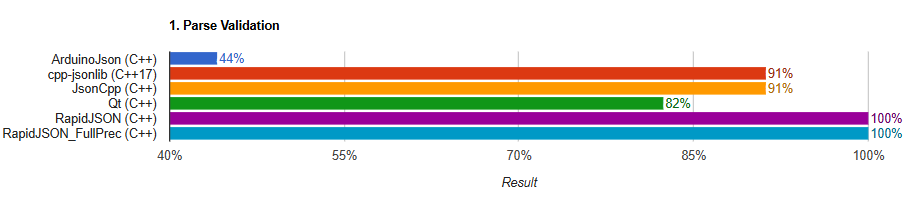
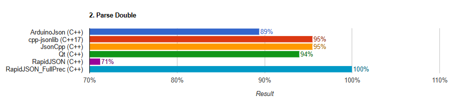
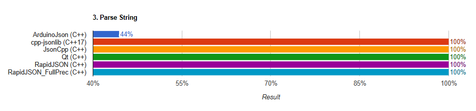
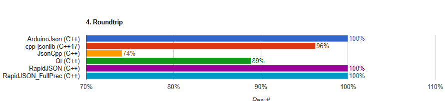
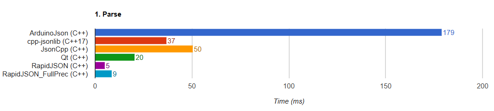
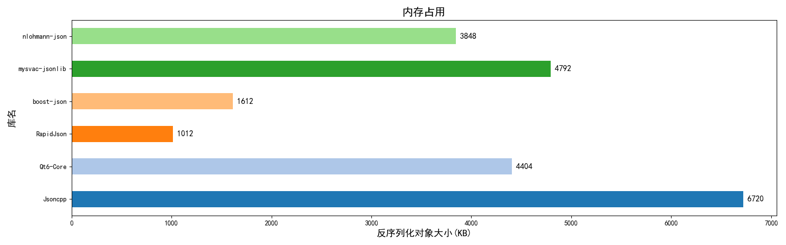
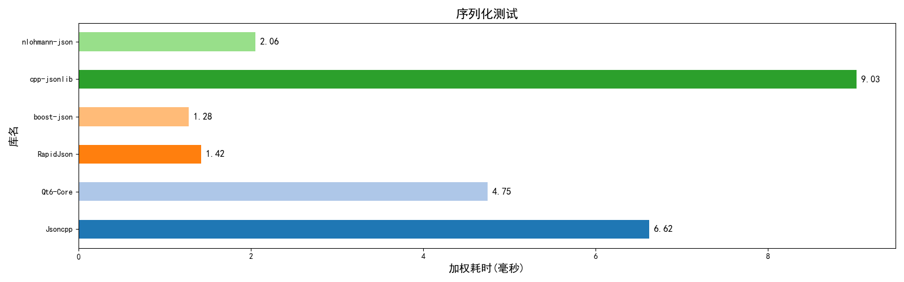
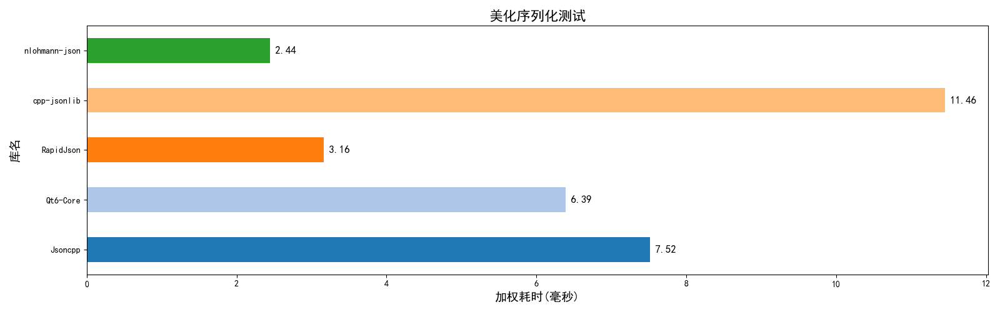

# 一个现代CPP-JSON库

## 概述
C++17标准，仅使用标准库，代码不到1000行，提供如下功能：
- 序列化，JSON控制对象->JSON文本。
- 反序列化，JSON文本 -> JSON控制对象。
- 便捷的 增、删、改、查。
- 移动语义支持。
- 异常处理支持。

## 文档
↓↓↓↓↓↓↓↓↓↓↓↓↓↓↓↓<br>
[C++Doxygen文档](https://mysvac.github.io/cpp-jsonlib/documents/html/index.html)<br>
↑↑↑↑↑↑↑↑↑↑↑↑↑↑↑↑

## 应用示例

### 0. 导入库与头文件
你可以直接下载`src`和`include`中的两个文件，放到项目中使用。<br>
也可以作为第三方库导入，方式如下：

```shell
# 推荐使用vcpkg进行第三方依赖管理（正在尝试加入vcpkg）
# 全局模式
vcpkg install mysvac-jsonlib

# 清单模式
vcpkg add port mysvac-jsonlib
```

```cmake
# CmakeLists.txt
find_package(mysvac-cpp-jsonlib CONFIG REQUIRED)
target_link_libraries(main PRIVATE jsonlib::jsonlib)
```

```cpp
// C++代码 导入头文件
#include "jsonlib.h"
```

### 1. 三种可操作类型和六种JSON数据类型
```cpp
// 广义的“值类型”，实际上包含 对象 数组 等全部6种JSON数据类型。
class Jsonlib::JsonValue;
// 对象类型，本质是 std::map<std::string, Jsonlib::JsonValue>
class Jsonlib::JsonObject;
// 数组类型，本质是 std::vector<Jsonlib::JsonValue>
class Jsonlib::JsonArray;


// 使用 JsonValue.type() 函数，获取内部JSON数据类型
enum class JsonType{
    OBJECT, /**< JSON 对象类型 */
    ARRAY,/**< JSON 数组类型 */
    STRING, /**< JSON 字符串类型 */
    NUMBER, /**< JSON 数值类型 */
    BOOLEN, /**< JSON 布尔类型 */
    ISNULL, /**< JSON null类型 */
};
```

### 2. 反序列化与序列化
```cpp
// 使用 Jsonlib::deserialize( str ) 函数进行反序列化
Jsonlib::JsonValue json = Jsonlib::deserialize(R"__JSON__(
    {
        "语法": ["C++", "原始字符串", false ],
        "key": "支持\t中文\\\n与\"转义字符",
        "na\"\\me": [ 114,514 , null ],
        "map": [ {} , [ [ "嵌套" ] , {} ] ]
    }
    )__JSON__");

// 对象.serialize() 序列化，不保留无效空格
std::cout << json.serialize() << std::endl;
// 对象.serialize_pretty() 序列化，带空格和换行，默认一次缩进2空格，可指定
std::cout << json.serialize_pretty() << std::endl;
```

特别注意，`std::string`类型的构造和赋值，不会解析内容。解析请使用`deserialize()`函数。
```cpp
// 0. 字符串构造， json0.type()是 STRING，serialize输出的结果是 "123456"
Jsonlib::JsonValue json0 { "123456" }; 

Jsonlib::JsonValue json1 ("123
456"); // 正确，自动反转义，然后两端加上双引号，变成 "123\n345"

Jsonlib::JsonValue json2 = Jsonlib::deserialize(R"(  "123
456"  )"); // 错误，解析内容，不会反转义，认为是字符串，但是内部出现了换行符，抛出异常。 应该写成 "123\n456"。
```

### 3. 增删改查
```cpp
// json变量是上面【2. 反序列...】中的json变量
json.erase("na\"\\me"); // 删除
json["map"][1].clear(); // 清空
json["语法"] = 114514; // 修改
json["add"] = Jsonlib::deserialize("[[[]]]"); //增加
json["add"].push_back(1); 

std::cout << json.serialize() << std::endl;
std::cout << json["key"].as_string() << std::endl; // 获取字符串并转义
```
可能的输出：
```
{"add":[[[]],1],"key":"支持\t中文\\\n与\"转义字符","map":[{},[]],"语法":114514}
支持	中文\
与"转义字符
```

### 4.使用is检测类型，使用as获取内容
```cpp
Jsonlib::JsonValue value = 123456789012345ll;
// is保证不会抛出异常
value.is_array(); // false
value.is_object(); // false
value.is_double(); // false 内部没有小数点
value.is_number(); // true int64和double都算number
// as 转换失败时抛出异常
value.as_int64(); // 123456789012345ll
value.as_double(); // 1.23457e+14 能够转化，但可能丢失精度
value.as_array(); // 抛出异常 Jsonlib::JsonTypeException
```


### 5. 迭代器与移动语义支持
```cpp
Jsonlib::JsonValue my_obj = Jsonlib::deserialize( R"__JSON__(
    {
        "key1" : "value1",
        "key2" : [ null , 666 ]
    }
)__JSON__");

Jsonlib::JsonValue my_arr = Jsonlib::deserialize( R"__JSON__(
    [
        null,
        {}
    ]
)__JSON__");

// 纯文本类型，不会解析内部数据，不会报错
Jsonlib::JsonValue my_val {"[ {} this is string ]"};

// 获取内部数据的引用，然后可以范围for
// as_array() 和 as_object() 返回引用，其他的 as_XXX() 返回副本
for(auto& it: my_arr.as_array()){ 
    // 操作...
}

// 支持移动语义，移动后初始成null值，不会删除
my_arr.insert(1, std::move(my_obj["key2"]));
my_arr.push_back(my_val);
// JsonArray和JsonObject也能隐式转换成JsonValue，可以直接赋值或移动

std::cout << my_arr.serialize_pretty() << std::endl;
```
可能的输出：
```json
[
  null,
  [
    null,
    666
  ],
  { },
  "[ {} this is string ]"
]
```


### 6. 异常处理
本库使用了三种自定义异常和一种标准：
1. `Jsonlib::JsonException` : 继承自`std::runtime_runtime_error`，没有地方抛出此异常。
2. `Jsonlib::JsonTypeException` : 继承自`JsonException`，表示类型错误。<br>
（比如对值类型使用了`[]`运算符，或`as_XXX()`类型转换失败。）
3. `Jsonlib::JsonStructureException` : 继承自`JsonException`，表示JSON结构错误。<br>
（将JSON格式的文本 反序列化失败时 抛出。）
4. `std::out_of_range` : 使用`at()`严格访问子元素，元素不存在或越界时抛出，

例：
```cpp
try{
    Jsonlib::JsonValue json = Jsonlib::deserialize("[ {}} ]");
}
catch(const Jsonlib::JsonStructureException& e){
    std::cerr << "JsonStructureException: " << e.what() << std::endl;
}
catch(const Jsonlib::JsonException& e){
    std::cerr << "JsonException: " << e.what() << std::endl;
}
catch(...){ std::cerr << "other" << std::endl; }
```
可能的输出：
```
JsonStructureException: Unknown Json Structure.
```

#### 注意
赋值/拷贝/移动/序列化/is类型检查/type()/size()...等操作保证不会抛出异常。

只有deserialze()反序列化函数，或者类型转换失败，访问越界时可能抛出异常。

## 效率概述
*时间复杂度其实没什么用，看看就好，后面都是常数优化。*
- **N** : JSON文本长度。
- **m** : 子元素个数。
- 下面提供最坏情况的时空复杂度（虽然没什么用，后面都是常数优化。）：
- **序列化**：时间复杂度O(N)，空间复杂度O(N)。
- **反序列化**: 时间复杂度O(N)，空间复杂度O(N)。
- **键值对-增删改查**: O(log m)。
- **数组-增删**: 末尾操作O(1)，其余位置平均O(m)。
- **数组-改查**: O(1)。

## 对比其他库
测试框架-1（不推荐使用）: <https://github.com/miloyip/nativejson-benchmark><br>
测试框架-2 : <https://github.com/Mysvac/cpp-json-test>


### 一致性测试
测试C++库解析json数据的正确性，语法严格性，浮点型精度等内容。

#### 整体分数


#### 反序列化测试
json字符串->可操作对象。<br>
反序列化错误格式能否识别，正确格式能否解析准确等。


#### 浮点数解析
解析后的精度差，各自格式的解析能力。


#### 字符串解析
非法字符串能否检测，字符转义是否正确。


#### roundtrip不知道是什么


### 性能测试

#### 反序列化耗时（越低越好）


#### 内存占用（越低越好）


#### 序列化耗时
可操作对象->json字符串。<br>


#### 序列化+美化耗时
美化是指输出的JSON文本带换行和缩进。（下面没显示的库就是不支持美化输出。）

