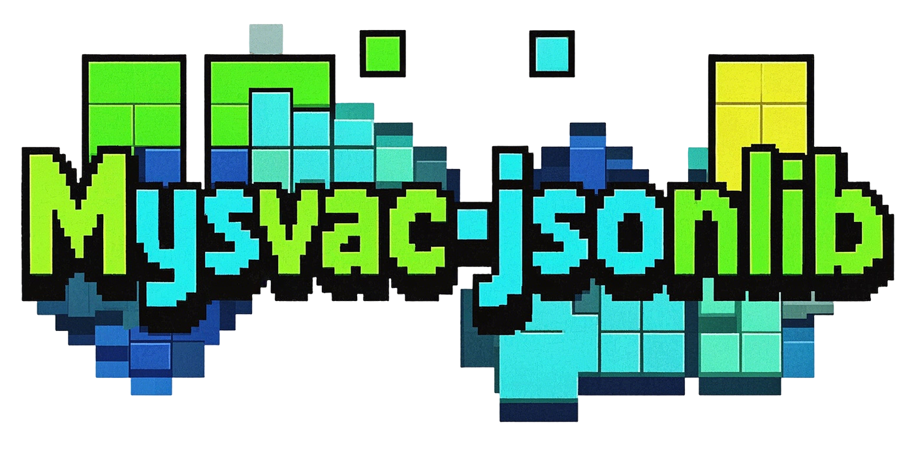

# **mysvac-jsonlib**

A simple and efficient C++20 JSON parsing library.

- Only one module interface file.
- Provide macro files to simplify custom type serialization.
- Excellent performance.
- Easy to use.
- Support streaming parsing and CRUD.

> -> **[Performance Comparison](https://github.com/Mysvac/cpp-jsonlib?tab=readme-ov-file#lib_compare)**

## Install

The library only contains one module interface file, which can be downloaded and used directly. 

The author recommends using vcpkg:

```shell
vcpkg install mysvac-jsonlib;
```

CMakeLists.txt config:

```cmake
find_package(mysvac-jsonlib CONFIG REQUIRED)
...
target_link_mysvac_jsonlib(main PRIVATE)
```

> `target_link_mysvac_jsonlib` includes `target_link_library` and `target_sources`, the latter is used to add module compilation targets.

cpp files:

```cpp
import mysvac.json;
using namespace mysvac;
```


## Example

### 1. init and get_ref


```cpp
// create by initialize_list
Json val = Json::Obj{
    { "key1", 42 },
    { "key2", "value2" },
    { "key3", true },
    { "arr", Json::Arr{ { 2, 3.14, nullptr } } },
    { "obj", Json::Obj{ { "nested_k", "nested_v" } } }
};

// use is_xxx() or type() to determine type
std::cout << val.is_arr(); << std::endl; // 0 (false)
json::Type type = val["key3"].type(); // json::Type::eBol

// use xxx() to get ref
double& key1 = val["key1"].num(); // get reference
key1 = 55.0;

// operators== can be used for all types, noexcept
std::cout << val["arr"][3] == "hello" << std::endl; // 1

// auxiliary function, such as size, insert, contains
val["arr"].push_back( "hello" );

val[2]; // throw runtime_error, because val isn't array

val.reset(); // clear date and become `Nul` type
```

There are six functions for getting internal ref: `arr()` `obj()` `num()` `str()` `bol()` `nul()`, and six functions `is_xxx()` for determining internal types.

### 2. serialize and deserialize

```cpp
// top-level can be any JSON type
std::string json_val_str = R"( false )"; 
// deserialize by `parse` function, return a option<>
std::optional<Json> = Json::parse(json_val_str); 

std::string json_str = R"( [ 1, false, null, { "Hello": "World" } ] )";
Json val = Json::parse(json_str).value_or(nullptr); 
// `parse` can also input `istream`

// serialize by dump or write
std::string text = val.dump(); // return string
// write to ostream or string back
val.write( std::cout ); 

// serialize_pretty by dumpf or writef
auto pretty = val.dumpf(); // default indentation is 2 spaces
std::string buffer;
val.writef( buffer, 4 ); // set indentation as 4 spaces
```

### 3. to and move API

```cpp
std::string json_str = R"( [ 1, false, null, { "Hello": "World" } ] )";
Json val = Json::parse(json_str).value_or(nullptr); 

// use `to<>` to copy inner data and cast type
int t1 = val[0].to<int>(); // 1

// use to_if or to_or cast data safely
std::optional<int> t2 = val[2].to_if<int>(); // std::nullopt
double t3 = val[3].to_or<double>( 3.14 ); // 3.14

// to `move<>` to move inner data and cast type
std::string world = val[3]["Hello"].move<std::string>();
// ↑ Prioritize using `move` over `copy`

// or use `move_if` `move_or` safely
```

## README

For more guidelines, please refer to the [readme](https://github.com/Mysvac/cpp-jsonlib?tab=readme-ov-file#ENGLISH).

---

